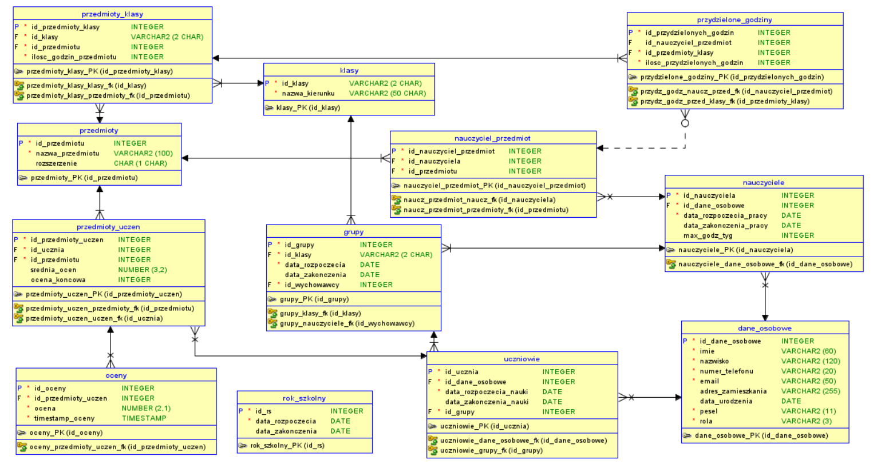

# oracle database for middle school data management

## A functional EXAMPLE project written in SQL and PL/SQL featuring:

* Oracle Database creation
* Loading data from .csv files using SQL *Loader
* Procedures and functions written in PL/SQL
* Command line interface to showcase database functionality (functionality/menu.sql)

## .sql scripts execution order:

1. create_tables.sql
2. procedures.sql
3. populate_tables.sql
4. views.sql
5. scheduler.sql

## Database UML diagram:

